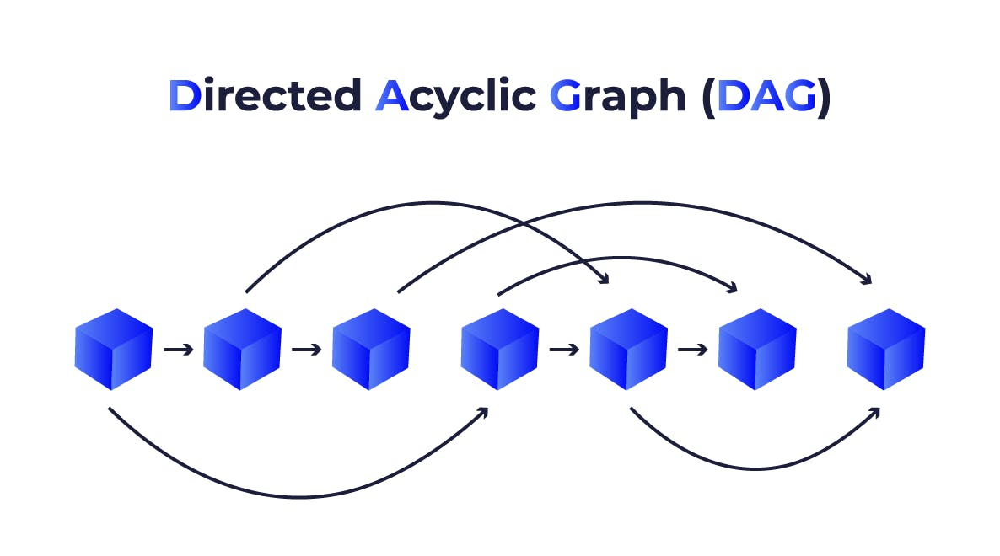

# Table of Contents
- [Dataset Sources](#dataset-sources)
  - [List of Dataset Sources](#list-of-dataset-sources)
  - [Persian Datasets](#persian-datasets)
  - [How Big Companies Gather Datasets](#how-big-companies-gather-datasets)
- [How to Avoid Storing Redundant Data](#how-to-avoid-storing-redundant-data)
- [Lets Build!](#lets-build)
  - [Building a Tree-structured Web Crawler with Scrapy](#building-a-tree-structured-web-crawler-with-scrapy)
    - [Implementation Details](#implementation-details)
  - [Parsing RSS Fields](#parsing-rss-fields)
    - [Building the Data Model with SQLAlchemy](#building-the-data-model-with-sqlalchemy)
    - [Parsing the RSS Fields with feedparser](#parsing-the-rss-fields-with-feedparser)
  - [Running The Projects Priodically with Apache Airflow](#running-the-projects-priodically-with-apache-airflow)
    - [Installation](#installation)
    - [Defining the DAG](#defining-the-dag)
    
## Dataset Sources
### List of Dataset Sources
- [Kaggle](https://kaggle.com)
- [Google dataset search](https://datasetsearch.research.google.com/)
- [FiveThirtyEight](https://data.fivethirtyeight.com/)
- Searching datasets in Github. [Example](https://github.com/search?q=dataset&type=repositories)
- [datahub.io](https://datahub.io/collections)
- [UCI Machine Learning Repository](http://archive.ics.uci.edu/)
### Persian Datasets
- https://github.com/mahmoud-eskandari/PersianBooksDataset
- https://github.com/MEgooneh/awesome-Iran-datasets
- https://www.kaggle.com/datasets/saeedtqp/persian-books-dataset/data
### How Big Companies Gather Datasets
- User Interaction and Activity Data
- Third-Party Data Providers
- Public Data and Open Data
- Surveys and Polls
- IoT Devices and Sensors
- Web Scraping
- Internal Business Data
- Crowdsourcing
- Synthetic Data
- Partnerships and Collaborations
- Social Media and Digital Platforms
- Data from Marketing Campaigns
- Partnerships with Hardware Manufacturers
## How to Avoid Storing Redundant Data
* Hashing
   * Content Fingerprinting
   * Consistent Hashing (for the Distributed Crawling)
* Bloom Filter
* Trie Data Structure (on URLs)
* Database with Indexed URLs
* Graph-based Approach (BFS and DFS)
* Similarity Based Approach
   * MinHash
   * SimHash
   * Consine Similarity
   * Jaccard Similarity
   * Levenshtein Distance
   * Structural Similarity (Comparing the Web Page's DOM)
## Lets Build!
### Building a Tree-structured Web Crawler with Scrapy

The best option for creating a tree-structured web crawler is Scrapy. [^1]

#### Implementation Details

1. Creating a New Scrapy Project:
```shell
scrapy startproject datamooncrawling
```

2. Defining the Spider:
```python
import scrapy
from scrapy.spiders import Spider
from scrapy import Request

class MySpider(Spider):
    name = "news_spider"
    allowed_domains = ["isna.ir", "irna.ir", "farsnews.ir"]
    start_urls = [
        "https://www.isna.ir/",
        "https://www.irna.ir/",
        "https://www.farsnews.ir/"
    ]
    custom_settings = {
        "DEPTH_LIMIT": 2
    }

    def parse(self, response):
        data = response.xpath("//p//text() | //h//text() | //h1//text() | //h2//text() | //h3//text() | //h4//text() | //h5//text() | //h6//text()").getall()
        data = [data_item.strip() for data_item in data if data_item.strip() not in ['', None]]
        yield {'data': data}
        
        for href in response.xpath("//a/@href").getall():
            yield scrapy.Request(response.urljoin(href), self.parse)
```

The `name` field will be used to initiate the crawling process by running the following command:
```shell
scrapy crawl news_spider
```

The `start_urls` list serves as the starting point for crawling. This is where we define the seed websites for the crawler.

By setting the `DEPTH_LIMIT` option, we can control the maximum depth of the crawled tree. Setting it to 2 will make the crawling shorter, aligning with my goal of retrieving the most recent news.

The content we need to save is typically found inside either a `p` tag or an `h*` tag. To extract this, we use the `xpath` selector. Then, yielding the data will pass the it to the pipeline that we define in the next section.

The crawling continues by following all the links existed in the current page using the `scrapy.Request` function.

3. The Pipeline Logic:
```python
from itemadapter import ItemAdapter


class DatamooncrawlingPipeline:
    def open_spider(self, spider):
        self.f = open('output.txt', 'a', encoding='utf-8')
    
    def close_spider(self, spider):
        self.f.close()
        
    def process_item(self, item, spider):
        item_adapter = ItemAdapter(item)
        self.f.writelines(item_adapter['data'])
        return item
```

This pipeline is pretty straightforward. It grabs the extracted data and writes it to a file called `output.txt`.


### Parsing RSS Fields
#### Building the Data Model with SQLAlchemy
SQLAlchemy [^2] is a powerful and flexible ORM that simplifies database interactions. I'll use this tool for storing for storing the `SHA-256` hash values of the parsed RSS data to avoid storing duplicate items.

1. A folder called `DB` holds the database related functionalities which has a structure as:
```
├── config.py // Stores the database connection URI as an envionment variable
├── db.py // Creates and returns the SQLAlchemy DB engine.
├── __init__.py // Makring this folder as a Python package.
├── models 
│   ├── hash_model.py // The model used for storing the hash values.
│   └── __init__.py
└── services
    ├── hash_service.py // The function for adding a new hash to the database and checking for existence of a hash has been defined in this file.
    └── __init__.py

```

2. The `hash_model.py` holds the data model:
```python
from sqlalchemy import Column, Integer, String
from sqlalchemy.ext.declarative import declarative_base

Base = declarative_base()

class Hash(Base):
    __tablename__ = 'hash'
    id = Column(Integer, primary_key=True, index=True)
    hash_value = Column(String(256), unique=True, nullable=False)
```
I defined two columns for storing the id and hash value of the item. The `Base` variable will be used to persist the model in the DB in the `db.py` file.

3. The DB session needs to be accessible through a [Python generator](https://wiki.python.org/moin/Generators):
```python
from sqlalchemy import create_engine
from sqlalchemy.orm import sessionmaker
from .config import DATABASE_URL
from .models import Base

engine = create_engine(DATABASE_URL)
SessionLocal = sessionmaker(autocommit=False, autoflush=False, bind=engine)
Base.metadata.create_all(engine)

def get_db():
    db = SessionLocal()
    try:
        yield db
    finally:
        db.close()
```

The `create_all` function uses the `Base` defined in `hash_model.py` to ensure that the "hash" table exists in the database. It is an idempotent function, meaning that it creates the table if it does not exist; otherwise, it does nothing.

The `get_db` function is a generator, so calling it does not directly provide access to the DB session. We need to wrap the `get_db` function call with the built-in `next` function to retrieve the DB session.

4. Defining the Hash Services

I need two hash functionalities: adding a hash value to the DB and checking if the hash exists in the DB. The `hash_service.py` holds these two services:
```python
from sqlalchemy.orm import Session
from ..models.hash_model import Hash, Base
from ..db import engine


def add_hash(db: Session, hash_value: str):
    db_hash = Hash(hash_value=hash_value)
    db.add(db_hash)
    db.commit()
    
    # Making sure the db_hash object is the same as the object that is in the database because the database might have triggered other mechanism that we don't know about
    db.refresh(db_hash)
    return db_hash

def hash_exists(db: Session, hash_value: str) -> bool:
    return db.query(Hash).filter(Hash.hash_value == hash_value).first() is not None
```
The query function needs access to the `Hash` model to determine which table to work with. Other variants of SQLAlchemy (e.g., those used with the Flask framework) do not require the model to be passed to their query function; however, the original one does.

#### Parsing the RSS Fields with feedparser
Now, it is the time for retrieving the RSS data and store it in a file.
```python
from bidi.algorithm import get_display
import arabic_reshaper
import feedparser
from DB.db import get_db
import hashlib
from DB.services.hash_service import hash_exists, add_hash

def fa_print(text):
    reshaped_text = arabic_reshaper.reshape(text)
    display_text = get_display(reshaped_text)
    print(display_text)

rss_urls = [
    "https://www.asriran.com/fa/rss/allnews",
    "https://www.irna.ir/rss"
]

db = next(get_db())

with open('output_rss.txt', 'w', encoding='utf-8') as output_file:
    for rss_url in rss_urls:
        feed = feedparser.parse(rss_url)
        # fa_print(f"عنوان فید: {feed.feed.title}")
        # fa_print(f"توضیحات: {feed.feed.description}")
        # fa_print(f"لینک: {feed.feed.link}\n")
        print('this is the url', rss_url)
        for entry in feed.entries:
            # check if the same entry has been fetched already
            sha256_hash = hashlib.sha256(f"{entry.title}{entry.published}".encode()).hexdigest()
            print(sha256_hash)
            if hash_exists(db, sha256_hash):
                continue
            add_hash(db, sha256_hash)
            try:
                data = entry.title
                fa_print(f"عنوان: {entry.title}")
            except:
                pass
            else:
                output_file.write(f"عنوان: {entry.title}")
                
            try:
                fa_print(f"لینک: {entry.link}")
            except:
                pass
            else:
                output_file.write(f"لینک: {entry.link}")

            try:
                fa_print(f"تاریخ: {entry.published}")
            except:
                pass
            else:
                output_file.write(f"تاریخ: {entry.published}")

            try:
                fa_print(f"خلاصه: {entry.summary}\n")
            except:
                pass
            else:
                output_file.write(f"خلاصه: {entry.summary}\n")
```

The `fa_print` function ensures that the printed text is displayed correctly in the Linux terminal. The rest of the code is straightforward: the hash services I defined earlier are used to determine whether data should be stored in the database.
### Running The Projects Priodically with Apache Airflow
The `Apache Airflow`[^3] is a perfect tool for building data pipeline. It's the powerful alternative to the `Linux's Cron Jobs` which let us to define our pipeline logic through what is called a DAG. DAG stands for `Directed Acyclic Graph`. In the simple term, a DAG file shows the order of the tasks that needs to be run and their respective orders.


#### Installation
`Airflow` has a lot of dependencies, so installing it in a separate environment won't messes out system-wide Python packages up.
```shell
python3 -m venv ~/airflow-env
source ~/airflow-env/bin/activate
pip install airflow[postgres]
```
The `Postgres` variant of `Airflow` allows tasks to run simultaneously via the `LocalExecutor`, while the `sqlite` variant—which is installed by default with the plain `airflow` pip package—does not have this capability and uses the `SequentialExecutor`. This option can be configured in the `apache.cfg` file located in its home directory, which is determined by the `AIRFLOW_HOME` environment variable. This directory is where Airflow stores its configuration and files.
```shell
export AIRFLOW_HOME=~/airflow # This line have be added to the .bashrc file.
airflow db init
airflow users  create --role Admin --username admin --email admin --firstname admin --lastname admin --password admin # This line needs to be run only once.
airflow webserver -D # running this command and the command below as the daemon
airflow scheduler -D
```


Now, the web interface is accessible at `localhost:8080`:


#### Defining the DAG
My DAG code is as follows:
```python
from datetime import datetime, timedelta

from airflow import DAG
from airflow.operators.python import PythonOperator
from airflow.operators.bash import BashOperator

from RSSParser.RSSParser import rss_parser_operation


default_args = {
    "depends_on_past": False,
    "email": ["thisisalinton@gmail.com"],
    "email_on_failure": False,
    "email_on_retry": False,
    "retries": 1,
    "retry_delay": timedelta(minutes=5),
}

with DAG(
    "news_crawling",
    default_args=default_args,
    description="A dag for managing the crawling of the news websites",
    start_date=datetime.today() - timedelta(days=1),
    schedule="@hourly",
    catchup=False,
) as dag:
    crawler_task = BashOperator(
        task_id="crawl_news_websites",
        bash_command="cd /home/ali/Desktop/wresteling-with-data/dags/ScrapyWebCrawler/datamooncrawling/datamooncrawling && scrapy crawl news_spider"
    )
    
    rss_task = PythonOperator(
        task_id="second_useless_job",
        python_callable=rss_parser_operation
    )
    
crawler_task >> rss_task
```

The `default_arg` is passed to every task and each task can use that arguments if the respected `kw args` is not provided in its function call.

Defining the properties of a DAG is done is done through some important attributes such as `start_date` and `schedule`. The `schedule` can have different formats.

After defining each task, the order of execution can be set through the bitwise operator at the end of the DAG file. There are a lot of flexible routing ways for executing the tasks which can be found in the Airflow documentation.

We can see the defined DAG in the Airflow's dashboard, now.


By clicking on each task, we can have more information regarding the task.

Enabling this DAG ensures that the data we have is always up-to-date and can be used for purposes such as adapting LLMs.

[^1]: [Scrapy Documentation](https://docs.scrapy.org/en/latest/)
[^2]: [SQLAlchemy Documentation](https://docs.sqlalchemy.org/)
[^3]: [Apache Airflow Documentation](https://airflow.apache.org/docs/apache-airflow/stable/)
